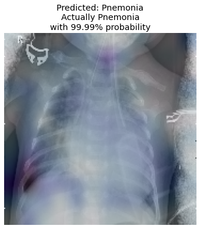
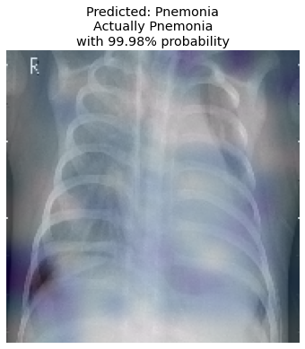

# Visualizing-Pneumonia-using-Deep-Learning
In this repository, I implement a deep convolutional model and visualize the predictions using the Grad-CAM Visualization method on chest X-rays of patients with and without Pneumonia. I am able to achieve 84% accuracy with a model only ~2MB in size.

